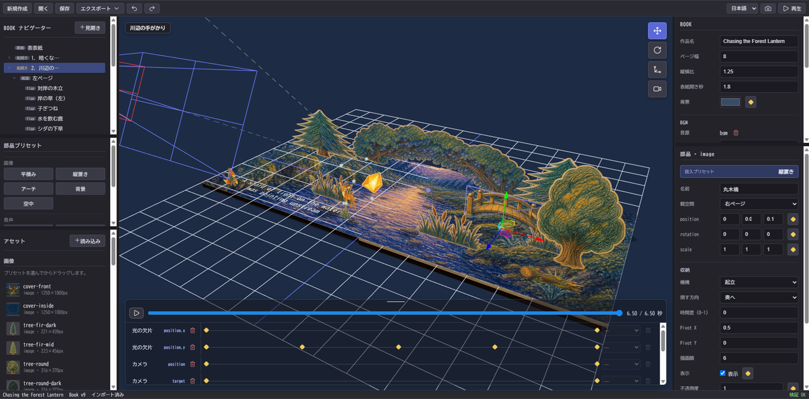

# tobidas

<p align="center">
  
</p>

<p align="center"><strong>Build and publish interactive web stories that unfold like pop-up books.</strong></p>

<p align="center">
  <a href="https://tobidas.9rsgy78c9c.workers.dev/">Open the online builder</a>
  ·
  <a href="./README.md">日本語</a>
</p>

<p align="center">
  
  
  
  
</p>

## What is tobidas?

tobidas is a local-first browser builder for creating and playing landscape-oriented, pop-up-book-style web stories.
You author each spread in its fully open state; tobidas derives how its pages and paper elements fold while the book opens and closes.

You can start immediately at [tobidas.9rsgy78c9c.workers.dev](https://tobidas.9rsgy78c9c.workers.dev/).
Project data and imported assets are processed in your browser and are not uploaded to the tobidas server.
You can also clone this repository and run it locally or deploy it to your own static host.

## Features

- Page glue, standing parts, and automatic V-folds for artwork crossing the spine
- Automatic outside routing for airborne parts inferred from their open pose
- Images, SVG, audio, web fonts, text, and particles placed on transparent planes
- Timeline control for transforms, opacity, visibility, assets, backgrounds, lights, and cameras
- Spread editing with 3D gizmos and property panels
- Background music and sound effects such as page turns
- Japanese and English UI
- State and direct controls for user-side browser-use AI
- Automatic browser-local saves
- Export as a single HTML file or a ZIP for static hosting

## Use the online builder

1. Open [tobidas.9rsgy78c9c.workers.dev](https://tobidas.9rsgy78c9c.workers.dev/) in Chrome or Edge.
2. Choose **New** to start a project, or **Open** to select an existing project folder.
3. Import assets, choose a preset, and place elements on a spread.
4. Use **Play** in the upper-right corner to preview the book and its animation.
5. Use **Save** for an editable project folder and **Export** for publishable files.

Desktop Chrome or Edge is recommended because folder access uses the File System Access API.

## Use with browser-use AI

Enable **AI mode** in the toolbar to expose the current project, spread, selected part, asset IDs, and validation results as semantic DOM.
AI mode switches to a dedicated workspace with a control pane on the left and a viewport on the right at roughly a 1:2 ratio.
The standard editing panes and timeline are not duplicated, so browser-use AI can select targets, load assets, place and update parts, undo, and inspect playback from the left pane.
AI mode can place an image by page and normalized coordinates without dragging on the Canvas.

Append `?ai=1` to the URL when a browser-use AI should start with the mode enabled.
The mode does not add an AI service or external communication, so projects and assets remain in the browser.
Its enabled state and operation results are not stored in project data.

## Project folders

A project is a folder containing JSON data and its assets.

```text
my-book/
├─ project.json
└─ assets/
   ├─ page-left.png
   ├─ character.webp
   └─ page-turn.wav
```

Project-format compatibility is managed by the tobidas application release.

Two publishing formats are available:

- **Single HTML** — embeds every asset in one file that can be opened directly after download.
- **Static host** — packages `index.html` and `assets/` as a ZIP for services such as Cloudflare Pages.

## Sample projects

The `projects/` directory contains four ready-to-open samples:

- `forest_lantern` — Chasing the Forest Lantern
- `morning_walk` — The Walk to School
- `four_seasons` — One Window, Four Seasons
- `crooked_castle` — The Crooked Castle

Download or clone the repository, then select one of these folders with **Open** in the builder.
The samples and bundled assets have terms separate from the software license.
See the [Asset License](./ASSET_LICENSE.md).

## Run locally

Requirements:

- Node.js 20.19 or later, or 22.12 or later
- npm
- Desktop Chrome or Edge

```bash
git clone https://github.com/jun76/tobidas.git
cd tobidas
npm ci
npm run dev
```

Open `http://localhost:5174/`.

## Self-host

```bash
npm ci
npm run build
```

Deploy the generated `dist/` directory to any static host. For Cloudflare Pages:

| Setting | Value |
|---|---|
| Build command | `npm run build` |
| Build output directory | `dist` |
| Node.js | 22 or later |

The app expects to be served at the root of a domain. Hosting it below a subpath requires adjusting
`base` in `vite.config.ts` and the bundled-player URL.

## Development

```bash
npm run typecheck
npm test
npm run build
```

Agent instructions for creating books are in [AGENTS.md](./AGENTS.md).
Instructions for developing tobidas itself are in [AGENTS_DEV.md](./AGENTS_DEV.md).

## Privacy

tobidas is local-first. Projects, images, audio, and fonts are processed in the user's browser.
Automatic saves use IndexedDB. The hosted builder has no feature that uploads project data to its server.

## License

Software code and documentation text are licensed under the [Apache License 2.0](./LICENSE).

The sample projects under `projects/**`, bundled assets under `scripts/samples/assets/**`, the favicon,
and other visual or audio assets are not covered by Apache-2.0. They are governed by
[ASSET_LICENSE.md](./ASSET_LICENSE.md).
