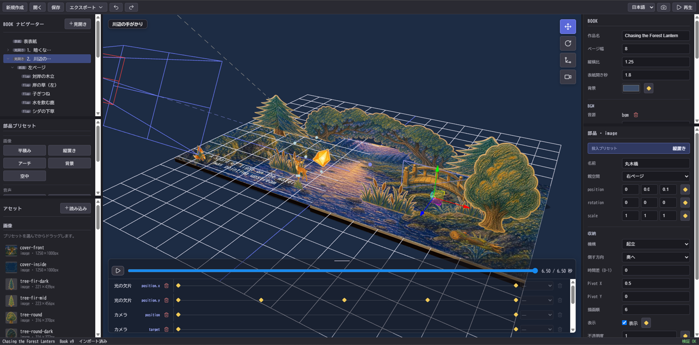

# tobidas

<p align="center">
  
</p>

<p align="center"><strong>Build and publish interactive web stories that unfold like pop-up books.</strong></p>

<p align="center">
  <a href="https://tobidas.9rsgy78c9c.workers.dev/">Open the online builder</a>
  ·
  <a href="https://tobidas-demo.9rsgy78c9c.workers.dev/">See a published example</a>
  ·
  <a href="./README.md">日本語</a>
</p>

<p align="center">
  
  
  
</p>

## What is tobidas?

tobidas is a local-first browser builder for creating and playing landscape-oriented, pop-up-book-style web stories.
You author each spread in its fully open state; tobidas derives how its pages and paper parts fold while the book opens and closes.

You can start immediately at [tobidas.9rsgy78c9c.workers.dev](https://tobidas.9rsgy78c9c.workers.dev/).
Project data and imported assets are processed in your browser and are not uploaded to the tobidas server.
You can also clone this repository and run it locally or deploy it to your own static host.

## Features

- Twelve basic parts that open and close while connected to real paper faces and folds (upright, angled upright, rear standing part, lateral connection, background panel, V-fold, platform, folding box, accordion, opposing fold, flat layer, and text)
- Automatic support-paper design that follows placement and movement, with glue, stowing, and intersection checks across the whole opening range (support paper visibility is a per-project setting and is hidden by default)
- Printed decorations, animated visuals, and light particles attached to real paper faces
- Custom-part editing, a local library, and exchange as part folders or ZIP files
- Images, SVG, video, audio, web fonts, and text
- Timeline control for transforms, opacity, visibility, assets, backgrounds, lights, and cameras
- 3D gizmos that move, angle, and scale parts while keeping their connections, plus detailed editing in the inspector
- Background music and sound effects such as page turns
- Text read aloud with the browser voice, and a text list for external text-to-speech
- Per-spread page jumps shared by the exported player and the builder's play mode
- Japanese and English UI
- State and direct controls for user-side browser-use AI, and structured WebMCP tools
- Automatic browser-local saves
- Export as a single HTML file or a ZIP for static hosting

The start screen offers **Edit picture book**, **Edit custom part**, and **Settings** (display language).
The custom-part library starts empty. [Exchange-part examples and test books](./examples/parts/README.md) are included.
Each part has a maximum input opening angle: a 180° part attached to a 90° connection stops in an intermediate pose, and a part limited to 150° cannot be placed on a 180° connection.

Printed decorations, spinning blades, moving characters, and light particles can be attached to real paper faces.
Paper outlines and holes, decorations, motion, and materials can be bundled into a custom part and reused as a part ZIP.
Whole projects can also be exchanged with **Export → Editable project ZIP** and **Open project ZIP**.

## Use the online builder

1. Open [tobidas.9rsgy78c9c.workers.dev](https://tobidas.9rsgy78c9c.workers.dev/) in Chrome or Edge.
2. Choose **Edit picture book**, then **New** to start a project, **Open** to select a project folder, or **Open project ZIP** to select an editable project ZIP.
3. Import assets, choose a basic or custom part in the parts panel on the left, and click faces of the book to place it.
4. Use **Play** in the upper-right corner to preview the book opening and closing with its animation.
5. Use **Save** for an editable project folder and **Export** for publishable files.

Desktop Chrome or Edge is recommended because folder access uses the File System Access API.

## Use with browser-use AI

Browser-use AI and people operate the same standard builder.
The BOOK navigator, assets, inspector, and timeline expose ARIA and stable `data-tobidas-*` identifiers.
Project, selection, active-spread, and preview state are available on the standard workspace element.

Press a basic- or custom-part button, then left-click connection face 1 and connection face 2 on the book.
Single-face parts such as text are placed with one click.
A badge in the upper left shows the current step; the hovered face is hatched blue, and faces that cannot hold the part are hatched red.
Required support bridges are added during placement. Press Esc to cancel; right-drag to orbit the view.
After placement, W moves along the connected face, E edits the matching design angle, and R scales uniformly.
The gizmo and the inspector's **Adjust connected placement** use the same checks and update the support paper and connections of later children.
While dragging, the paper and its supports follow immediately; paper intersections and conflicts with attached motion are checked in the background without stopping the view. An invalid position is shown in red, and releasing commits only a value that passes the full opening and closing check.
Support-paper dimensions and glue positions are decided while placing or editing, and playback folds the same paper. Candidates whose paper shape or glue positions would change during opening and closing are not committed.
Alt disables snapping and Esc cancels the whole drag. One drag is undone with one Undo.
Uprights edit their tilt above the ground, and background panels edit their screen angle.
The **Angled upright**, which changes direction on the ground, is driven by triangular support paper on the fold it shares with the background.
The editable range follows from the connection and dimensions; candidates whose stowing or intermediate intersections cannot be verified are not committed.
Edit detailed dimensions and connections after placement in the inspector's **Size and placement / Connection**, with an opening preview.
Assign images and text in the inspector after placement.
The information button on an asset row reveals its asset ID, MIME type, exact byte size, and reference count.
BGM can be selected from imported audio, or cleared with **Not set**, directly in the Sound section.
Changing a parent and adding a timeline key with an explicit value and time are available as standard detail actions.
These detail forms are closed by default, so they do not add permanent fields or change the normal pane layout.

WebMCP-capable browsers can discover structured tools as soon as the page loads, without a special query parameter.
Environments without WebMCP fall back to the same standard UI's semantic DOM, ARIA, and detail actions.
The **AI operation tips** badge distinguishes tool registration, the public Origin Trial, browser-specific settings for Chrome, Edge, and Firefox, and compatible AI clients.
tobidas does not add an AI service or external communication, so projects and assets remain in the browser.
Temporary detail-form values and operation results are not stored in project data.

Project-specific production guidance is available and editable per language in the **Authoring guide** pane below the Inspector.
This setting is the source of truth for picture-book know-how. WebMCP clients read the selected language with `tobidas-get-authoring-guide` and update it with `tobidas-update-authoring-guide` only when the user explicitly requests a change.

### Narrate an exported player

The exported player has neither WebMCP nor any network feature. An agent that drives the browser directly advances the book with the playback bar buttons and reads the text from a visually hidden semantic region.
For a book narrated by an external TTS, turn off "Read text with the browser voice" in the Sound section of the builder before exporting. Such a book never calls Web Speech. Per-element speech marks (Japanese / English) remain as the definition of what to read and in which language.

Above the playback bar, outside its frame, one translucent button per spread (`Page 1` … `Page N`) is laid out with equal widths. Pressing one jumps immediately to the frame where that spread's turn starts (the hold end of the previous spread, or the closed cover for the first spread), plays the turn and the pop-up motion at the authored speed, and stops at the hold end of that spread. The last spread does not stop there but continues until the back cover has closed. The stopping point is the same from anywhere, so a narrator can read in order or start from any spread. The button of the current spread carries `aria-current="page"`.
The player starts with the cover closed, so press `Page 1` to read the first spread.
Pressing a page button during autoplay stops autoplay and enters manual mode. Pressing the play button in manual mode resumes autoplay from that position.
The play mode of the builder has the same page buttons, so the stopping points can be checked while authoring.
When playback or a page jump reaches the end (back cover closed), the BGM fades out over about 2.5 seconds and stops, and the player then returns to the closed cover by itself (unless something is pressed meanwhile). The next press of the play button or a page button starts the music from the beginning. To show several books in a row, load each exported HTML in turn: every load starts with the cover closed and carries nothing over from the previous book.

The player exposes the following region. Its attributes change only when the state or the current spread changes.

```html
<div data-tobidas-kind="player-state"
     data-tobidas-playback="manual"        <!-- auto | manual | turning -->
     data-tobidas-spread-index="2"         <!-- absent while the cover is opening -->
     data-tobidas-spread-count="8"
     data-tobidas-read-aloud="false">
  <ol aria-label="Current spread text">
    <li data-tobidas-element="el_12" lang="ja">Once upon a time…</li>
  </ol>
</div>
```

The text list follows the same rule as browser speech: only visible text with a speech mark, in element order.

The standard agent procedure is:

1. Open the player exported with read-aloud turned off.
2. Click the button of the spread to read (`Page k`).
3. Re-read the accessibility tree until `data-tobidas-playback` returns to `manual`. `data-tobidas-spread-index` changes as soon as the spread is fully open, so wait for that instead to start reading during the motion.
4. Pass the items of `Current spread text` to the TTS in order and finish playback.
5. Repeat from step 2 for the next spread to read; in order that is `Page k+1`, up to `data-tobidas-spread-count`.

### Use WebMCP

When the browser exposes WebMCP, tobidas registers structured tools when the page starts.
WebMCP is an additional capability connected to the same operations as the standard UI, not a separate screen or mode.

The tools accept stable target IDs, normalized coordinates, and typed timeline values directly.
Tool results include the committed target, any placement or layout corrections, and validation counts.
WebMCP does not upload asset binaries, fetch external URLs, delete assets, save projects, or export files.
Continue to use **Load** in the standard Assets panel to import assets.

WebMCP tools are not rendered as an on-screen list of buttons.
A WebMCP-capable AI or a Model Context Tool Inspector can discover them after opening the page.
To inspect them from the browser console, run:

```js
const context = document.modelContext ?? navigator.modelContext;
const tools = context ? await context.getTools() : [];
tools.map((tool) => tool.name);
```

#### Minimal connection check for agents

1. Open `http://localhost:5174/` in a browser with WebMCP enabled.
2. Wait until the toolbar shows **AI tools available**.
3. Retrieve the page-defined tools from the calling AI and confirm that `tobidas-get-state` is listed. The tool set differs between the start screen, picture-book editing, and part editing, so list the tools again after switching screens.
4. Call `tobidas-get-state` once without arguments and confirm a successful response.

Tools are registered asynchronously after the page starts. If the list is empty right after loading, do not treat it as a failure; list the tools again after **AI tools available** appears. If listing the tools or calling `tobidas-get-state` fails, check the browser setting and the calling AI's WebMCP support, then fall back to the standard builder's semantic DOM, ARIA, and detail actions.

#### Access paths

| Where tobidas runs | Browser-side enablement | User action |
| --- | --- | --- |
| [Public web app](https://tobidas.9rsgy78c9c.workers.dev/) | Embed a WebMCP Origin Trial token issued for the target origin and browser in the served HTML | Chrome or Edge needs no setting when its matching token is embedded; Firefox uses its browser setting |
| Local clone | Enable the browser-specific WebMCP setting listed below in Chrome, Edge, or Firefox | Restart the browser and open `http://localhost:5174/` |
| Browser or AI environment without WebMCP | Do not use WebMCP | Use the standard builder's semantic DOM, ARIA, and detail actions |

Enabling the browser API through an Origin Trial or browser-specific setting is separate from using an AI environment that can discover and call page-defined tools.
Both conditions are required for the structured WebMCP tools.
Support for listing and invoking page tools can vary with the AI client, its version, and the selected model.
The toolbar's **AI tools available** status means that the page registered its tools; it does not guarantee that the calling AI can retrieve them.
To verify the complete path, list the tools from the AI environment and call `tobidas-get-state` first.
The Chrome WebMCP Origin Trial covers Chrome 149 through 156 and is scheduled to end on November 17, 2026.
Use the [WebMCP Origin Trial registration page](https://developer.chrome.com/origintrials/#/register_trial/4163014905550602241) for the official deployment.

#### Browser compatibility

WebMCP availability differs by browser.

| Browser | WebMCP access path | Confirmed behavior |
| --- | --- | --- |
| Chrome | Origin Trial for the public app; Chrome setting for a local clone | The imperative tools listed below |
| Edge | Edge Origin Trial or Edge setting | The imperative tools listed below |
| Firefox | Enable `dom.modelcontext.enabled` and `dom.modelcontext.testing.enabled` in `about:config` | The imperative tools listed below through `navigator.modelContext`; `document.modelContext` is not confirmed |

For a local clone, enable the setting for the current browser and restart it. Chrome uses `chrome://flags/#enable-webmcp-testing`; Edge uses `edge://flags/#enable-webmcp-testing`.
The public web app embeds an Origin Trial token issued for its exact origin and browser provider, so matching Chrome or Edge users do not need to change browser settings. A token cannot be reused for another origin or browser provider.
Firefox's `dom.modelcontext.*` preferences are experimental testing controls. Firefox currently uses the older `navigator.modelContext` surface for imperative tools.
See the [WebMCP implementation status](https://github.com/webmachinelearning/webmcp/blob/main/implementation-status.md) for the broader browser status.

When WebMCP is unavailable, browser automation uses the standard builder's DOM, ARIA, and closed-by-default detail actions.
Availability is determined by the combination of browser support or Origin Trial enablement and the calling AI's ability to list and invoke page tools.

#### Available tools

When WebMCP is available, tobidas registers the following imperative tools according to the visible workspace.
Picture-book editing registers every group except **Part editing**, plus `tobidas-create-part-draft` and `tobidas-open-part-library`.
Custom-part editing registers the **Parts**, **Content**, and **Part editing** groups, plus `tobidas-get-state`, `tobidas-enter-edit`, and `tobidas-enter-play`.
The start and settings screens register only `tobidas-get-state`, `tobidas-enter-edit`, `tobidas-enter-play`, `tobidas-get-part-catalog`, `tobidas-create-part-draft`, and `tobidas-open-part-library`.

| Group | Tool | Purpose |
| --- | --- | --- |
| Read | `tobidas-get-state` | Read the current tobidas project state without asset binary data. Use this first to obtain stable spread and element IDs; scope defaults to full and can be active-spread or selection. |
| Read | `tobidas-get-authoring-guide` | Read the current work's authoring guide in the selected language, including labels, short descriptions, and saved text. Use it before design, asset preparation, placement, or verification. |
| Edit | `tobidas-update-authoring-guide` | Update selected authoring-guide keys in the selected language. Use only when the user explicitly requests a change; normal validation, undo, and autosave still apply. |
| Read | `tobidas-get-spread` | Read one spread including its pages, elements, and timeline. Pass a spreadId returned by tobidas-get-state. |
| Read | `tobidas-get-element` | Read one element using its stable spread and element IDs. Pass IDs returned by tobidas-get-state or tobidas-get-spread. |
| Read | `tobidas-list-assets` | List imported asset metadata and references for later placement or BGM assignment; never returns binary asset data or uploads files. |
| Read | `tobidas-validate-book` | Read the latest tobidas validation errors and warnings. An optional spreadId limits the returned spread context. |
| Read | `tobidas-audit-layout` | Audit paper containment, stow warnings, airborne-part counts, and page-background assignments for one spread or the whole book. Visual screenshot review remains separate. |
| Session | `tobidas-select-target` | Select a book, light, cover, spread, page, or element for human-visible supervision. Use the corresponding ID fields for spread, page, and element targets. |
| Session | `tobidas-set-preview` | Move the visible preview to a normalized book progress or a spread hold time. Provide progress, or provide spreadId with seconds within that spread hold interval. |
| Session | `tobidas-enter-play` | Enter playback mode so the person can inspect the book. This changes only the visible editing session. |
| Session | `tobidas-enter-edit` | Return to edit mode so structured book changes can be made. This changes only the visible editing session. |
| Parts | `tobidas-get-part-catalog` / `tobidas-get-part-mounts` | Read basic-part specifications, the custom library, and the real faces and connection ports. |
| Parts | `tobidas-place-part` / `tobidas-update-placed-part` | Place or change a part after checking its connection, dimensions, opening angle, and stowing. Custom definitions and assets are bundled into the book. |
| Parts | `tobidas-place-part-on-surfaces` | Specify one or two real faces and material coordinates, as on the canvas. Support paper is added automatically and placement goes through the common checks and undo path. |
| Parts | `tobidas-get-part-edit-controls` / `tobidas-edit-placed-part` | Read the operation axes, angle handles, and scale along real faces, then move, change design angles, scale uniformly, or resize while keeping connections. |
| Content | `tobidas-place-content` | Attach a printed decoration, animated visual, or light particles to a material point on a real face. Holes cannot hold content. |
| Content | `tobidas-edit-connected-content` | Change the anchor, side, parent face, or local presentation transform of attached content. Animation keys are unchanged, and the whole connection path is validated. |
| Edit | `tobidas-set-page-background` | Assign an imported image, SVG, or video directly to the page surface instead of creating an element. Use this, rather than a flat paper-stack element, for full-page artwork. |
| Edit | `tobidas-clear-page-background` | Clear page-surface artwork and its background-video audio settings. |
| Part editing | `tobidas-get-part-draft` / `tobidas-create-part-draft` / `tobidas-update-part-definition` | Read or create a draft independent of any book, and edit its description, input angle, and public dimensions. |
| Part editing | `tobidas-add-part-node` / `tobidas-update-part-node` / `tobidas-delete-part-node` | Edit internal parts and the connection graph with typed commands. |
| Part editing | `tobidas-edit-part-node` / `tobidas-expose-part-edit-handle` | Apply connection-preserving edits to internal parts, and expose angle controls of basic or nested parts. |
| Part editing | `tobidas-expose-part-parameter` / `tobidas-expose-part-material` / `tobidas-expose-part-port` | Expose dimensions, materials, and faces or connection ports. |
| Part editing | `tobidas-set-part-shape` | Set or clear the outer contour and holes of a material face in normalized 0–1 material coordinates. Existing glue lines and content anchors must stay on material. |
| Part editing | `tobidas-upsert-part-content` / `tobidas-delete-part-content` | Add or edit internal decorations and motion with their tracks, or delete one together with its dependent content. |
| Part editing | `tobidas-save-part-library` / `tobidas-open-part-library` / `tobidas-part-undo` / `tobidas-part-redo` | Save immutable revisions, open entries for editing or copying, and use the separate part-editing history. |
| Edit | `tobidas-update-element` | Update one tobidas element through layout normalization and validation. The input is a full typed update, not an arbitrary JSON patch; omitted fields keep their current values. |
| Edit | `tobidas-move-element` | Reparent one tobidas element to a page or another element while preserving normal constraints. The move is committed through the common edit, validation, and undo path. |
| Edit | `tobidas-set-element-parent` | Explicit, discoverable alias for `move-element` that changes the parent to a page or another element. |
| Edit | `tobidas-delete-element` | Delete an element, its descendants, and their timeline tracks; requires `confirm=true`. |
| Edit | `tobidas-add-timeline-key` | Add or replace one typed timeline key in a spread hold interval. The time and value are validated against the selected target property. |
| Read | `tobidas-list-timeline-keys` | List tracks, keys, and stable IDs for a spread before an update or deletion. |
| Edit | `tobidas-update-timeline-key` | Update an existing key's time, typed value, or easing. |
| Edit | `tobidas-delete-timeline-key` | Delete an existing key and remove its track when it becomes empty. |
| Edit | `tobidas-set-camera` | Set the default author camera used by spreads without camera keys. |
| Edit | `tobidas-add-camera-key` | Save position, target, and field-of-view keys together at one spread hold time. |
| Edit | `tobidas-assign-bgm` | Assign one already imported audio asset as the project BGM. Import the audio through the standard Assets panel before calling this tool. |
| Edit | `tobidas-clear-bgm` | Clear the project BGM through the normal edit, validation, and undo path. |
| Edit | `tobidas-set-read-aloud` | Enable or disable browser speech (Web Speech) for the whole book. Per-element speech marks stay and still define the text listed for an external narrator. |
| Edit | `tobidas-add-spread` | Add, duplicate, or move a spread through the normal edit and undo path. The combined operation remains for compatibility. |
| Edit | `tobidas-duplicate-spread` | Duplicate a spread while remapping element, track, and key IDs. |
| Edit | `tobidas-reorder-spread` | Move a spread one position earlier or later. |
| Edit | `tobidas-delete-spread` | Delete an entire spread with `confirm=true`; the last remaining spread cannot be deleted. |
| Edit | `tobidas-undo` | Undo the last tobidas edit through the normal history. The result includes the current selection and preview state after undo. |
| Edit | `tobidas-redo` | Redo the last undone tobidas edit through the normal history. The result includes the current selection and preview state after redo. |

Asset import, opening projects, saving, and single-HTML or ZIP export remain user-managed file operations because they require browser file permissions and destination choices. Use the standard Assets panel and toolbar; WebMCP does not add a binary transport.
State for new paper parts includes the placed `part` and the bundled `partDefinitions`.
Positions and poses follow from connections and dimensions; independent floating fold axes and free-transform tracks are not used.
For final visual review, use `tobidas-set-preview` to prepare the view and capture the viewport with the calling Browser or Computer Use environment. `tobidas-audit-layout` reports deterministic structural issues, but it does not judge composition or visible overlap from an image.

Reading and writing part files as binaries uses the standard UI. Saving to the library is an in-browser operation.

## Project folders

A project is a folder containing JSON data and its assets.

```text
my-book/
├─ project.json
└─ assets/
   ├─ page-left.png
   ├─ character.webp
   └─ page-turn.wav
```

Project-format compatibility is managed by the tobidas application release.

Two publishing formats are available:

- **Single HTML** — embeds every asset in one file that can be opened directly after download.
- **Static host** — packages `index.html` and `assets/` as a ZIP for services such as Cloudflare Pages.

## Sample projects

[See Chasing the Forest Lantern in your browser](https://tobidas-demo.9rsgy78c9c.workers.dev/)
— `forest_lantern` exported from tobidas as a single HTML file and published.
Experience the opening pages, pop-up depth, animation, and sound without installing anything.

The `projects/` directory contains four ready-to-open samples:

- `forest_lantern` — Chasing the Forest Lantern
- `morning_walk` — The Walk to School
- `four_seasons` — One Window, Four Seasons
- `crooked_castle` — The Crooked Castle

Download or clone the repository, then select one of these folders with **Open** in the builder.
These are originals made in the format that predates basic parts (image parts folded by automatic stowing); they open, play, and edit as they are.

Versions of the same four books rebuilt with basic parts and attached content are generated into `.tmp/022-samples` with the following commands.
Open `022-samples-review/index.html` in the output to view them.

```bash
npm run build
npm run samples:generate -- --export
npm run samples:check
```

The samples and bundled assets have terms separate from the software license.
See the [Asset License](./ASSET_LICENSE.md).

## Run locally

Requirements:

- Node.js 20.19 or later, or 22.12 or later
- npm
- Desktop Chrome or Edge

```bash
git clone https://github.com/jun76/tobidas.git
cd tobidas
npm ci
npm run dev
```

Open `http://localhost:5174/`.

The repository also includes the [`tobidas-create` skill](./.agents/skills/tobidas-create/SKILL.md), which supports questions, design sheets, asset preparation, standard-builder/WebMCP construction, and verification. Work-specific production guidance and defaults are read from the work's **Authoring guide**. It can be used from Codex or another agent environment that supports repository skills.

## Self-host

```bash
npm ci
npm run build
```

Deploy the generated `dist/` directory to any static host. For Cloudflare Pages:

| Setting | Value |
|---|---|
| Build command | `npm run build` |
| Build output directory | `dist` |
| Node.js | 22 or later |

For a public build that participates in the WebMCP Origin Trial, put the issued token in `.env.webmcp-public` and run `npm run build:public`.

```dotenv
WEBMCP_ORIGIN_TRIAL_TOKEN=Chrome_token_issued_for_this_origin
# Add only when also enrolling in the Edge Origin Trial
WEBMCP_EDGE_ORIGIN_TRIAL_TOKEN=Edge_token_issued_for_this_origin
```

`build:public` fails when the Chrome token is absent and validates its signature, origin, feature name, and expiry.
It also requires subdomain matching and third-party matching to be off, then injects the token as `<meta http-equiv="origin-trial">` in `dist/index.html`.
The token is a public value visible in served HTML, but it expires, so keep it in the build environment instead of fixing it in source.
The official deployment registers `https://tobidas.9rsgy78c9c.workers.dev`; another self-hosted origin needs its own registration and token.
The current Chrome trial is scheduled to end on November 17, 2026. Review any extension or stable release and update both the token and guidance before that date.

The app expects to be served at the root of a domain. Hosting it below a subpath requires adjusting
`base` in `vite.config.ts` and the bundled-player URL.

## Development

```bash
npm run typecheck
npm test
npm run build
```

Agent instructions for creating books are in [AGENTS.md](./AGENTS.md).
Instructions for developing tobidas itself are in [AGENTS_DEV.md](./AGENTS_DEV.md).

## FAQ

### Why can't I call WebMCP tools from gpt-5.6-luna in the Codex App?

This appears to be a model-specific limitation or integration issue in the Codex App's Browser path, rather than a tobidas tool-registration failure.
In the tested environment, the page-side WebMCP API and **AI tools available** status were active, but gpt-5.6-luna stopped while listing tools with `gpt-5.6-luna does not support command "webmcp_list_tools"`. On the same page and browser setup, gpt-5.6-sol and gpt-5.6-terra successfully listed the tools and called `tobidas-get-state`.

Because the error occurs inside the Codex App before `tobidas-get-state` is invoked, it does not indicate a failure in tobidas's WebMCP registration, Origin Trial token, or browser setting. OpenAI's public documentation does not explicitly state that gpt-5.6-luna is unsupported for the Codex App's `webmcp_list_tools` command, and no exact matching official issue has been identified. The official tracker does, however, contain open bug reports about [Browser plugin availability changing by model](https://github.com/openai/codex/issues/33592) and [missing tool injection for gpt-5.6-terra/luna](https://github.com/openai/codex/issues/33250).

For now, use gpt-5.6-sol or gpt-5.6-terra, or fall back to the standard builder's semantic DOM, ARIA, and detail actions. AI-client and model support can change, so tobidas does not require a particular Codex model.

## Privacy

tobidas is local-first. Projects, images, audio, and fonts are processed in the user's browser.
Automatic saves use IndexedDB. The hosted builder has no feature that uploads project data to its server.

## License

Software code and documentation text are licensed under the [Apache License 2.0](./LICENSE).

The sample projects under `projects/**`, bundled assets under `scripts/samples/assets/**`, the favicon,
and other visual or audio assets are not covered by Apache-2.0. They are licensed under
[CC BY 4.0](https://creativecommons.org/licenses/by/4.0/); see
[ASSET_LICENSE.md](./ASSET_LICENSE.md) for the terms.
