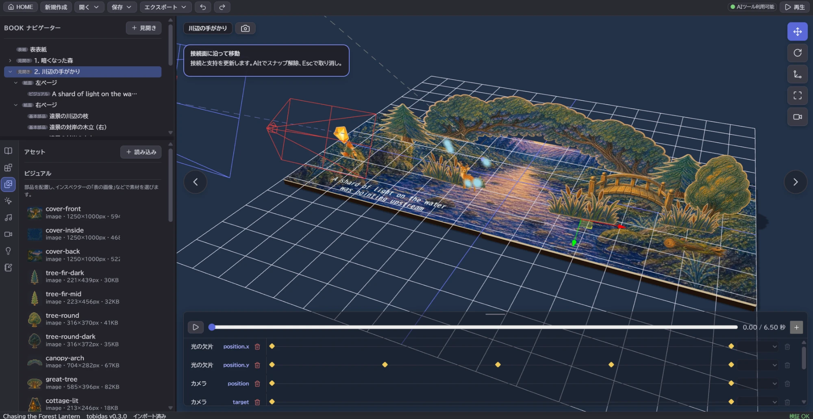

# tobidas

<p align="center">
  
</p>

<p align="center"><strong>飛び出す絵本のようなWeb作品を、ブラウザで組み立てて公開する。</strong></p>

<p align="center">
  <a href="https://tobidas.9rsgy78c9c.workers.dev/">オンライン版を使う</a>
  ·
  <a href="https://tobidas-demo.9rsgy78c9c.workers.dev/">公開作例を見る</a>
  ·
  <a href="./README.en.md">English</a>
</p>

<p align="center">
  
  
  
</p>

## tobidasとは

tobidasは、横開きの「飛び出す絵本風」Web作品を制作・再生するローカルファーストのビルダーです。
完全に開いた見開きを編集すると、ページを開閉するときの紙面や部品の動きを自動で組み立てます。

[tobidas.9rsgy78c9c.workers.dev](https://tobidas.9rsgy78c9c.workers.dev/) ですぐに使えます。
作品データや読み込んだ素材はブラウザ内で処理され、tobidasのサーバーへアップロードされません。
このリポジトリをクローンして、自分の環境や静的ホスティングで運用することもできます。

## 主な機能

- 実際の紙面と折り線に接続して開閉する12種類の基本部品（縦置き、斜め縦置き、最奥の起立部品、側方連結、背景パネル、二面折り、天板付き台、折り畳み箱、連続折り帯、対向折り、平積み、テキスト）
- 配置と移動に合わせた支持紙の自動設計と、全開閉の接着・収納・交差の検査（支持紙の表示は作品ごとに切り替え、既定では描かない）
- 紙面の装飾、動くビジュアル、光の粒子を実際の紙の面へ取り付ける演出
- カスタム部品の編集、ローカルライブラリ、部品フォルダー／ZIPによる交換
- 画像、SVG、動画、音声、Webフォント、テキストの配置
- 位置、回転、拡大率、不透明度、表示、素材、背景、照明、カメラのタイムライン制御
- 接続を保ったまま移動・角度・倍率を変える3Dギズモと、サイドバーのタブによる詳細編集
- BGMとページめくりなどの効果音
- ブラウザの音声による本文の読み上げと、外部の音声合成向けの本文一覧
- 再生画面とビルダーの再生モードに共通の、見開き単位のページ送り
- 日本語／英語UI
- 利用者側のブラウザ操作AI向け状態表示と直接操作、WebMCPの構造化ツール
- ブラウザ内の自動保存
- 単一HTMLファイル、または静的ホスト用ZIPへの書き出し

起動後のHOMEから「絵本作品を編集」「カスタム部品を編集」「設定」（表示言語とライト／ダークのテーマ）を選べます。
カスタム部品の初期ライブラリは空です。[交換部品の例と検証作品](./examples/parts/README.md)を用意しています。
部品には入力の最大開口角があり、180°対応部品を90°の接続先へ付けると途中姿勢になります。150°までの部品は180°の接続先へ配置できません。

紙面の装飾や、回転する羽根・動く人物・光の粒子を、実際の紙の面へ取り付けられます。
紙の外周と穴、装飾、動作、素材をカスタム部品へまとめ、部品ZIPで再利用できます。
作品全体も「保存 → 作品ZIPとして保存」と「開く → 作品ZIPを開く」で交換できます。

## オンライン版を使う

1. [tobidas.9rsgy78c9c.workers.dev](https://tobidas.9rsgy78c9c.workers.dev/) をChromeまたはEdgeで開きます。
2. 「絵本作品を編集」を選び、「新規作成」で作品を作るか、「開く」から「フォルダを開く」または「作品ZIPを開く」を選びます。
3. 素材を読み込み、左の部品パネルから基本部品やカスタム部品を選んで、本の面をクリックして配置します。
4. 右上の「再生」でページの開閉と演出を確認します。
5. 「保存」から「フォルダとして保存」または「作品ZIPとして保存」で編集用の作品を保存し、「エクスポート」で公開用ファイルを書き出します。

フォルダの読み書きにFile System Access APIを使うため、デスクトップ版ChromeまたはEdgeを推奨します。
ほかのブラウザでも、作品ZIPの読み書きと、単一HTMLファイル・静的ホスト用ZIPの書き出しは使えます。

## ブラウザ操作AIから使う

ブラウザ操作AIと利用者は、同じ標準ビルダーを操作します。
左サイドバーは、上段のBOOKナビゲーターと、下段の縦並びのアイコンで切り替えるタブ（作品、部品、アセット、選択中、サウンド、カメラ、ライティング、制作ガイド）でできています。
部品や表紙を選ぶと「選択中」タブへ自動で切り替わります。部品タブを開いている間は、続けて配置できるよう切り替えません。
BOOKナビゲーター、サイドバーの各タブ、タイムラインには、ARIAと安定した `data-tobidas-*` 識別子があります。
作品ID、選択対象、アクティブな見開き、プレビュー位置は標準ワークスペースの属性から確認できます。

基本部品・カスタム部品のボタンを押し、本の上で接続面1、接続面2を順に左クリックして配置します。
テキストなどの一面部品は1クリックで配置できます。
選択中の段階を左上のバッジに表示し、触れている面を青、配置できない面を赤の網掛けで示します。
必要な支持ブリッジは配置時に補完されます。Escで中止、右ドラッグで視点を回転できます。
配置後はWで接続面上の移動、Eで対応する設計角度、Rで等比拡縮を操作できます。
ギズモと「選択中」タブの「接続を保って配置を調整」は同じ検査を使い、支持紙と後付けの子の接続を更新します。
ドラッグ中は紙と支持の形をその場で追従させ、紙の交差や演出との干渉の検査は描画を止めずに裏で続けます。成立しない位置は赤く示し、放したときに全開閉の検査を通った値だけを確定します。
支持紙の寸法と接着位置は配置編集時に決まり、再生中は同じ紙を折ります。開閉中に紙の形や接着位置が変わる候補は確定しません。
Altでスナップを解除し、Escでドラッグ全体を取り消します。一回のドラッグは一回のUndoで戻せます。
縦置きでは地面からの傾き、背景パネルでは屏風の開き角を編集します。
地面上の向きを変える「斜め縦置き」は、背景との共通折り線を基準に三角の支持紙で駆動します。
操作可能な範囲は接続先と寸法で決まり、収納や途中の交差を検査できない候補は確定しません。
配置後の寸法や接続の詳細は、「選択中」タブの「寸法と配置 / 接続先」で開閉プレビューとともに編集します。
画像と文字は配置後に「選択中」タブで指定します。
アセットID、MIME type、正確なbyte数、参照数は、アセット行の情報ボタンから確認できます。
BGMはサウンド欄のプルダウンから、取り込み済み音声または「未設定」を選べます。
親変更と、値と時刻を指定するタイムラインキー追加は、標準UIの詳細操作から実行できます。
詳細操作のフォームは既定では閉じているため、通常時のペイン構成と入力欄数は増えません。

WebMCP対応ブラウザでは、URLへ特別なクエリを付けなくても、ページ起動時から構造化ツールを発見できます。
非対応環境では、同じ標準UIの意味付きDOM、ARIA、詳細操作へフォールバックします。
ツールバーの「AI操作のヒント」から、WebMCPの登録状態、公開版のOrigin Trial、Chrome・Edge・Firefoxそれぞれの設定、対応AI環境を区別して確認できます。
外部AIとの通信機能はtobidasへ追加しておらず、作品と素材は従来どおりブラウザ内に残ります。
詳細フォームの一時値と操作結果は作品データへ保存されません。

作品ごとの制作方針は、左サイドバーの「制作ガイド」タブで表示言語ごとに確認・編集します。
この設定が作品づくりのノウハウの正本です。WebMCPでは `tobidas-get-authoring-guide` で指定言語の本文を参照し、利用者から明示的に依頼された場合だけ `tobidas-update-authoring-guide` で指定言語を更新します。

### 書き出した再生画面を読み上げる

書き出した再生画面にはWebMCPも通信機能もありません。ブラウザを直接操作するエージェントが、再生バーのボタンと視覚的に隠した意味付きDOMで作品を進め、本文を取り出します。
外部の音声合成で読ませる作品は、ビルダーのサウンド欄で「本文をブラウザの音声で読み上げる」を切ってから書き出します。切った作品はブラウザの Web Speech を呼びません。要素ごとの読み上げ指定 (日本語 / English) は、読む対象と言語の指定として残ります。

再生バーの上には見開きごとの半透過ボタン（`Page 1` … `Page N`）が、バーの枠の外に幅を均等に割って並びます。押した見開きのめくりが始まるフレーム（前の見開きの保持終端、最初の見開きなら閉じた表紙）へ直ちに飛び、めくりと演出を作者の速度で進めて、その見開きの保持終端（演出を見終えた姿勢）で止まります。最後の見開きだけは止まらず、裏表紙が閉じる末尾まで続けます。どこからでも同じ位置に止まるので、順に読むことも離れた見開きから読むこともできます。現在の見開きのボタンは `aria-current="page"` になります。
起動直後は表紙が閉じているため、最初の見開きは `Page 1` を押して読みます。
自動再生中に見開きボタンを押すと自動再生は止まり、手動モードへ移ります。手動モード中に再生ボタンを押すと、その位置から自動再生へ戻ります。
ビルダーの再生モードにも同じ見開きボタン（「1見開き目へ」…）があり、制作中に同じ止まり方を確認できます。
再生またはページ送りで末尾（裏表紙が閉じた状態）に到達するとBGMは約2.5秒でゆっくり消えて止まり、その後に閉じた表紙へ自動で戻ります（その間に操作があれば戻りません）。次に再生ボタンや見開きボタンを押すと曲の頭から鳴ります。複数の作品を続けて見せる場合は、作品ごとに書き出したHTMLを順に読み込み直します。読み込み直すたびに表紙が閉じた状態から始まり、前の作品の音や状態は残りません。

再生画面には次の領域があります。属性は状態と現在の見開きが変わったときだけ変わります。

```html
<div data-tobidas-kind="player-state"
     data-tobidas-playback="manual"        <!-- auto | manual | turning -->
     data-tobidas-spread-index="2"         <!-- 表紙を開いている間は付かない -->
     data-tobidas-spread-count="8"
     data-tobidas-read-aloud="false">
  <ol aria-label="Current spread text">
    <li data-tobidas-element="el_12" lang="ja">むかしむかし…</li>
  </ol>
</div>
```

本文一覧はブラウザ読み上げと同じ規則で作られ、読み上げ指定があり表示中の本文だけを要素順に含みます。

エージェントの標準手順は次のとおりです。

1. 読み上げを切って書き出した再生画面を開く。
2. 読みたい見開きのボタン（`Page k`）をクリックする。
3. `data-tobidas-playback` が `manual` に戻るまでアクセシビリティツリーを読み直す。`data-tobidas-spread-index` は見開きが開き切った時点で変わるため、演出中に読み始める場合はこちらを待つ。
4. `Current spread text` の項目を順に音声合成へ渡し、再生を終える。
5. 次に読む見開きがあれば 2 へ戻る。順に読むなら `Page k+1`、`data-tobidas-spread-count` が上限。

### WebMCPを使う

tobidasは、WebMCPに対応したブラウザでは、ページ起動時から標準ビルダーの操作をAI向けの構造化ツールとして公開します。
WebMCPは別画面や別モードではなく、標準UIと同じ共通操作へ接続する追加能力です。

WebMCPを使える場合は、AIが対象ID、正規化座標、タイムラインの型をそのまま指定できます。
ツールの実行結果には、storeへ反映した後の対象、収納やレイアウトの補正、検証件数を含めます。
アセット本体のアップロード、外部URLの取得、アセット削除、保存、エクスポートはWebMCPツールから行いません。
アセットの取り込みは、従来どおり標準のアセットパネルにある「読み込み」を使います。

WebMCPツールは画面上のボタン一覧としては表示されません。
WebMCP対応AIまたはModel Context Tool Inspectorがページを開くと、登録済みツールを発見できます。
ブラウザのコンソールで確認する場合は、次の式が使えます。

```js
const context = document.modelContext ?? navigator.modelContext;
const tools = context ? await context.getTools() : [];
tools.map((tool) => tool.name);
```

#### エージェントによる最小開通チェック

1. WebMCPを有効にしたブラウザで `http://localhost:5174/` を開く。
2. ツールバーに「AIツール利用可能」と表示されるまで待つ。
3. 呼び出し元AIからページ定義ツールを取得し、`tobidas-get-state` が一覧にあることを確認する。入口、絵本編集、部品編集でツールの構成が変わるため、画面を切り替えたら一覧を取り直す。
4. `tobidas-get-state` を引数なしで1回呼び出し、成功応答を確認する。

ツール登録はページ起動後に非同期で行われます。そのため、読み込み直後の取得結果が空なら失敗と判定せず、「AIツール利用可能」の表示後にツール一覧をもう一度取得します。ツール一覧の取得や `tobidas-get-state` の呼び出しに失敗した場合は、ブラウザ設定と呼び出し元AIのWebMCP対応を確認し、標準ビルダーの意味付きDOM・ARIA・詳細操作へフォールバックします。

#### 利用経路

| 利用場所                                             | ブラウザ側の有効化                                                        | 利用者の操作                                                                |
| ---------------------------------------------------- | ------------------------------------------------------------------------- | --------------------------------------------------------------------------- |
| [公開Web版](https://tobidas.9rsgy78c9c.workers.dev/) | 対象Originとブラウザ向けのWebMCP Origin Trialトークンを配信HTMLへ組み込む | 対応するトークンがあるChrome・Edgeでは開くだけ。Firefoxはブラウザ設定を使う |
| ローカルclone版                                      | Chrome・Edge・Firefoxで、それぞれ下記のWebMCP設定を有効化                 | 設定後にブラウザを再起動し、`http://localhost:5174/` を開く                 |
| WebMCP非対応のブラウザ・AI環境                       | WebMCPは使わない                                                          | 標準ビルダーの意味付きDOM、ARIA、詳細操作を使う                             |

Origin Trialや各ブラウザ設定でブラウザAPIを有効にすることと、そのツールを発見・呼び出せるAI環境を使うことは別の条件です。
ブラウザ側でWebMCPが有効でも、呼び出し元のAIクライアントがページ定義ツールの一覧取得と実行に対応していなければ、構造化ツールは利用できません。
この対応状況はAIクライアントの種類、バージョン、選択モデルによって異なる場合があります。
ツールバーの「AIツール利用可能」はページへの登録完了を示す表示であり、呼び出し元AIからの取得成功までは保証しません。
利用時はAI環境からツール一覧を取得し、まず `tobidas-get-state` を呼び出して接続を確認します。
ChromeのWebMCP Origin TrialはChrome 149〜156が対象で、終了予定日は2026年11月17日です。
公式公開版の登録には[WebMCP Origin Trial登録画面](https://developer.chrome.com/origintrials/#/register_trial/4163014905550602241)を使います。

#### ブラウザごとの動作状況

WebMCPの対応状況はブラウザごとに異なります。

| ブラウザ | WebMCPの利用経路                                                                           | 確認できている内容                                                                                     |
| -------- | ------------------------------------------------------------------------------------------ | ------------------------------------------------------------------------------------------------------ |
| Chrome   | 公開版はOrigin Trial、ローカル版はChrome設定                                               | 下記のimperativeツール                                                                                 |
| Edge     | Edge用Origin TrialまたはEdge設定                                                           | 下記のimperativeツール                                                                                 |
| Firefox  | `about:config`で `dom.modelcontext.enabled` と `dom.modelcontext.testing.enabled` を有効化 | `navigator.modelContext`から下記のimperativeツール。`document.modelContext`は未確認                    |

ローカルclone版では、現在のブラウザに合う設定を有効にして再起動します。Chromeは `chrome://flags/#enable-webmcp-testing`、Edgeは `edge://flags/#enable-webmcp-testing` を使います。
公開Web版では対象Originとブラウザ向けのOrigin TrialトークンをHTMLへ組み込み、そのトークンに対応するChromeまたはEdgeで利用者側の設定を不要にします。トークンはOriginと提供元ごとに発行されるため、別ドメインや別ブラウザへそのまま流用できません。
Firefoxの `dom.modelcontext.*` は実験・テスト用の内部設定です。Firefoxでは現状、旧APIの `navigator.modelContext` 経由でimperativeツールを利用します。
WebMCPの対応状況は、[WebMCPの実装状況](https://github.com/webmachinelearning/webmcp/blob/main/implementation-status.md)を参照してください。

WebMCPを使えない環境では、標準ビルダーのDOM、ARIA、既定で閉じた詳細操作を使います。
利用可否はブラウザだけで決まらず、ブラウザ設定またはOrigin Trialと、呼び出し元AIによるページツールの一覧取得・実行対応の組み合わせで決まります。

#### 提供するツール

WebMCPを利用できる条件では、表示中のワークスペースに応じて次のimperativeツールを登録します。
絵本編集では「部品編集」の分類を除くツールと、`tobidas-create-part-draft`、`tobidas-open-part-library` を登録します。
カスタム部品編集では「部品」「演出」「部品編集」の分類と、`tobidas-get-state`、`tobidas-enter-edit`、`tobidas-enter-play` を登録します。
入口と設定では、`tobidas-get-state`、`tobidas-enter-edit`、`tobidas-enter-play`、`tobidas-get-part-catalog`、`tobidas-create-part-draft`、`tobidas-open-part-library` だけを登録します。

| 分類       | ツール                           | 内容                                                                                                                                                  |
| ---------- | -------------------------------- | ----------------------------------------------------------------------------------------------------------------------------------------------------- |
| 読み取り   | `tobidas-get-state`              | アセット本体を含めず作品状態を取得する。最初に呼び出して見開きIDと部品IDを得る。範囲は作品全体、現在の見開き、現在の選択から選び、省略時は作品全体    |
| 読み取り   | `tobidas-get-authoring-guide`    | 現在の作品の制作ガイドを指定言語で取得する。ラベル、短い説明、保存済みの本文を返し、設計、素材準備、配置、検証の前に使う                              |
| 編集       | `tobidas-update-authoring-guide` | 現在の作品の指定言語の制作ガイドを指定キーだけ更新する。利用者が明示的に変更を依頼した場合に使い、通常の検証、undo、自動保存を通す                    |
| 読み取り   | `tobidas-get-spread`             | ページ、部品、タイムラインを含む1つの見開きを取得する。`tobidas-get-state`で得た見開きIDを渡す                                                        |
| 読み取り   | `tobidas-get-element`            | 安定した見開きIDと部品IDで部品を取得する。IDは状態または見開き取得結果から得る                                                                        |
| 読み取り   | `tobidas-list-assets`            | 後の配置やBGM割り当てに使うアセットのメタデータと参照情報を取得する。バイナリの返却やファイルのアップロードは行わない                                 |
| 読み取り   | `tobidas-validate-book`          | 最新の検証エラーと警告を取得する。見開きIDを渡すと、その見開きの文脈に絞る                                                                            |
| 読み取り   | `tobidas-audit-layout`           | 紙面包含、収納警告、空中部品数、ページ背景の割り当てを見開き単位または作品全体で監査する。スクリーンショットによる目視確認は別途行う                  |
| セッション | `tobidas-select-target`          | 作品、光源、表紙、見開き、ページ、部品を人が確認できる対象として選択する。見開き、ページ、部品には対応するIDを渡す                                    |
| セッション | `tobidas-set-preview`            | 表示中のプレビューを作品全体の正規化進行値、または見開きの保持時刻へ移動する。進行値、または見開きIDと保持区間内の秒数を指定する                      |
| セッション | `tobidas-enter-play`             | 人が作品を確認できる再生モードへ切り替える。表示中の編集セッションだけを変更する                                                                      |
| セッション | `tobidas-enter-edit`             | 構造化された作品編集ができる編集モードへ戻る。表示中の編集セッションだけを変更する                                                                    |
| 部品       | `tobidas-get-part-catalog` / `tobidas-get-part-mounts` | 基本部品の仕様、カスタムライブラリ、実際の面と接続口を取得する |
| 部品       | `tobidas-place-part` / `tobidas-update-placed-part` | 接続・寸法・開口角・収納を検査して配置または変更する。カスタム定義と素材を絵本に同梱する |
| 部品       | `tobidas-place-part-on-surfaces` | キャンバスと同様に一つまたは二つの実面と材料座標を指定する。支持紙を自動補完し、共通検査・undo経路で配置する |
| 部品       | `tobidas-get-part-edit-controls` / `tobidas-edit-placed-part` | 実面に沿う操作軸・角度ハンドル・倍率を取得し、移動・設計角度・等比拡縮・寸法を接続を保って編集する |
| 演出       | `tobidas-place-content`          | 紙面の装飾、動くビジュアル、光の粒子を実面の材料座標へ取り付ける。穴には取り付けない                                                                  |
| 演出       | `tobidas-edit-connected-content` | 取り付けた演出の基準点、表裏、取り付け面、ローカルの配置を変更する。アニメーションのキーは変えず、接続の経路全体を検査する                          |
| 編集       | `tobidas-set-page-background`    | 取り込み済みの画像、SVG、動画を部品ではなくページ面の背景へ直接設定する。全面ページ画像には平積み部品ではなくこのツールを使う                         |
| 編集       | `tobidas-clear-page-background`  | ページ背景と背景動画の音声設定を解除する                                                                                                              |
| 部品編集 | `tobidas-get-part-draft` / `tobidas-create-part-draft` / `tobidas-update-part-definition` | 絵本と独立した下書きを取得・作成し、説明、入力角度、公開寸法を編集する |
| 部品編集 | `tobidas-add-part-node` / `tobidas-update-part-node` / `tobidas-delete-part-node` | 内部部品と接続グラフを型付きコマンドで編集する |
| 部品編集 | `tobidas-edit-part-node` / `tobidas-expose-part-edit-handle` | 内部部品にも接続を保つ編集を適用し、基本部品または入れ子部品の角度操作を公開する |
| 部品編集 | `tobidas-expose-part-parameter` / `tobidas-expose-part-material` / `tobidas-expose-part-port` | 寸法、素材、面・接続口を公開する |
| 部品編集 | `tobidas-set-part-shape` | 材料面の外周と穴を0〜1の材料座標で設定または解除する。既存の接着線と演出の基準点は材料上に残す必要がある |
| 部品編集 | `tobidas-upsert-part-content` / `tobidas-delete-part-content` | 部品内部の装飾・演出とそのトラックを追加・編集し、依存する演出とともに削除する |
| 部品編集 | `tobidas-save-part-library` / `tobidas-open-part-library` / `tobidas-part-undo` / `tobidas-part-redo` | 不変の改訂を保存し、編集・コピーと部品専用の履歴を扱う |
| 編集       | `tobidas-update-element`         | レイアウト補正と検証を通して部品を更新する。入力は型付きの全体更新であり任意JSON置換ではなく、省略した項目は現在値を保つ                              |
| 編集       | `tobidas-move-element`           | 通常の制約を保ちながら部品をページまたは別の部品へ付け替える。共通の編集、検証、undo経路を通す                                                        |
| 編集       | `tobidas-set-element-parent`     | 親変更を名前から発見しやすくした`move-element`の明示的な別名。ページまたは別部品へ付け替える                                                          |
| 編集       | `tobidas-delete-element`         | `confirm=true`を必須として、部品、子孫、対応するタイムライントラックを削除する                                                                        |
| 編集       | `tobidas-add-timeline-key`       | 見開きの保持区間へ型付きタイムラインキーを追加または置換する。時刻と値は対象プロパティに対して検証する                                                |
| 読み取り   | `tobidas-list-timeline-keys`     | 見開きのトラック、キー、安定IDを取得する。更新・削除前に使う                                                                                          |
| 編集       | `tobidas-update-timeline-key`    | 既存キーの時刻、型付き値、補間方法を更新する                                                                                                          |
| 編集       | `tobidas-delete-timeline-key`    | 既存キーを削除し、最後のキーなら空になったトラックも削除する                                                                                          |
| 編集       | `tobidas-set-camera`             | カメラキーのない見開きで使う作品の既定カメラ姿勢を設定する                                                                                            |
| 編集       | `tobidas-add-camera-key`         | 指定した保持時刻へ位置、注視点、視野角のカメラキーを一括保存する                                                                                      |
| 編集       | `tobidas-assign-bgm`             | 取り込み済みの音声アセットを作品のBGMへ割り当てる。アセットは標準のアセットパネルで先に取り込む                                                       |
| 編集       | `tobidas-clear-bgm`              | 通常の編集、検証、undo経路を通して作品のBGMを解除する                                                                                                 |
| 編集       | `tobidas-set-read-aloud`         | 作品全体のブラウザ読み上げ (Web Speech) を有効・無効にする。要素ごとの読み上げ指定は残り、外部TTS向けの本文一覧の対象になる                          |
| 編集       | `tobidas-add-spread`             | 通常の編集とundo経路を通して見開きを追加、複製、移動する。既存呼び出しとの互換用に複合操作を保つ                                                      |
| 編集       | `tobidas-duplicate-spread`       | 見開きを複製し、部品、トラック、キーのIDを再採番する                                                                                                  |
| 編集       | `tobidas-reorder-spread`         | 見開きを一つ前または後ろへ移動する                                                                                                                    |
| 編集       | `tobidas-delete-spread`          | `confirm=true`を必須として見開き全体を削除する。最後の1見開きは削除しない                                                                             |
| 編集       | `tobidas-undo`                   | 通常の履歴を使って直前の編集を取り消す。取り消し後の選択とプレビュー状態を返す                                                                        |
| 編集       | `tobidas-redo`                   | 通常の履歴を使って取り消した編集をやり直す。やり直し後の選択とプレビュー状態を返す                                                                    |

アセットの追加、作品を開く、保存、単一HTML／ZIPの出力は、ブラウザのファイル権限と利用者の保存先選択を伴うためWebMCPへバイナリ経路を設けません。標準のアセットパネルとツールバーを使います。
新しい紙部品の状態取得には配置 `part` と同梱定義 `partDefinitions` を含みます。
位置や姿勢は接続先と寸法から決まり、独立した空中の折り軸や自由変形トラックは使いません。
最終的な見た目は `tobidas-set-preview` で確認位置を整え、呼び出し元のBrowser／Computer Use機能でビューポートをスクリーンショットします。`tobidas-audit-layout`は構造上の問題を返しますが、絵の重なりや構図の良否を画像として判定するものではありません。

部品ファイルのバイナリ読み書きは標準UIを使います。ライブラリへの保存はブラウザ内の操作です。

## 作品フォルダ

作品はJSONと素材をまとめたフォルダです。

```text
my-book/
├─ project.json
└─ assets/
   ├─ page-left.png
   ├─ character.webp
   └─ page-turn.wav
```

保存形式の互換性は、tobidas本体のリリースバージョンで管理します。

公開用の書き出しは2種類あります。

- **単一HTMLファイル** — 素材を1ファイルに埋め込みます。ダウンロード後、そのままブラウザで開けます。
- **静的ホスト用ZIP** — `index.html`と`assets/`をZIPにまとめます。展開してCloudflare Pagesなどの静的ホスティングへ置けます。

## サンプル作品

[Chasing the Forest Lanternをブラウザで見る](https://tobidas-demo.9rsgy78c9c.workers.dev/)
— `forest_lantern`をtobidasから単一HTMLとして書き出して公開した作例です。
インストールせず、そのままページの開閉、立体表現、アニメーション、サウンドを体験できます。

`projects/`には、すぐに読み込める4つのサンプル作品があります。

- `forest_lantern` — Chasing the Forest Lantern
- `morning_walk` — The Walk to School
- `four_seasons` — One Window, Four Seasons
- `crooked_castle` — The Crooked Castle

リポジトリをダウンロードまたはクローンし、ビルダーの「開く → フォルダを開く」から各フォルダを選んでください。
各作品は、紙面と折り線に接続した基本部品・カスタム部品と、紙の面に取り付けた演出で組まれています。

サンプルは生成定義から作られます。次のコマンドで `projects/` を再生成し、`.tmp/samples-review/index.html` から単一HTML版を鑑賞できます。

```bash
npm run build
npm run samples:generate -- --export
npm run samples:check
```

サンプル作品と同梱素材には、ソフトウェアとは別の利用条件があります。
詳しくは[アセットライセンス](./ASSET_LICENSE.md)を参照してください。

## ローカルで起動する

必要なもの:

- Node.js 20.19以降、または22.12以降
- npm
- デスクトップ版ChromeまたはEdge

```bash
git clone https://github.com/jun76/tobidas.git
cd tobidas
npm ci
npm run dev
```

`http://localhost:5174/`を開きます。

リポジトリには、質問、設計シート、素材準備、標準ビルダーとWebMCPによる構築、検証の流れを支援する [`tobidas-create` スキル](./.agents/skills/tobidas-create/SKILL.md) も同梱しています。作品固有の制作方針やデフォルト値は、作品の「制作ガイド」から参照します。スキル対応のCodexやエージェント環境から利用できます。

## セルフホスト

```bash
npm ci
npm run build
```

生成された`dist/`を静的ホスティングへ配置してください。Cloudflare Pagesでは次の設定を使えます。

| 設定                   | 値              |
| ---------------------- | --------------- |
| Build command          | `npm run build` |
| Build output directory | `dist`          |
| Node.js                | 22以降          |

WebMCP Origin Trialを使う公開ビルドでは、発行されたトークンを `.env.webmcp-public` へ設定して `npm run build:public` を使います。

```dotenv
WEBMCP_ORIGIN_TRIAL_TOKEN=対象Origin向けのChromeトークン
# Edge側のOrigin Trialにも参加する場合だけ追加
WEBMCP_EDGE_ORIGIN_TRIAL_TOKEN=対象Origin向けのEdgeトークン
```

`build:public` はChrome用トークンがない場合に失敗し、署名、対象Origin、機能名、有効期限を検査します。
サブドメイン対象とThird-party matchingがOFFであることも確認し、トークンを `<meta http-equiv="origin-trial">` として `dist/index.html` へ組み込みます。
トークンは配信HTMLから読める公開値ですが期限があるため、ソースへ固定せずビルド環境で更新します。
公式公開版のトークンは `https://tobidas.9rsgy78c9c.workers.dev` に対して発行します。セルフホスト先が別Originなら、そのOriginを別途Origin Trialへ登録してください。
Chromeの現在のtrialは2026年11月17日に終了予定です。延長や正式提供の状況を確認し、期限前にトークンと案内を更新します。

アプリはドメインのルートで配信する構成です。サブパスへ配置する場合は、
`vite.config.ts`の`base`とプレイヤー取得先の調整が必要です。

## 開発

```bash
npm run typecheck
npm test
npm run build
```

エージェント向けの作品制作規約は[AGENTS.md](./AGENTS.md)、
tobidas本体の実装規約は[AGENTS_DEV.md](./AGENTS_DEV.md)にまとめています。

## FAQ

### Codex Appのgpt-5.6-lunaからWebMCP toolを呼べないのですが？

tobidasのツール登録ではなく、呼び出し元であるCodex AppのBrowser連携におけるモデル別対応の問題と考えられます。
確認した環境では、ページ側のWebMCP APIと「AIツール利用可能」の表示は有効でも、gpt-5.6-lunaはツール一覧取得時に `gpt-5.6-luna does not support command "webmcp_list_tools"` で停止しました。同じページとブラウザ環境で、gpt-5.6-solとgpt-5.6-terraからはツール一覧の取得と `tobidas-get-state` の実行に成功しています。

このエラーは `tobidas-get-state` を呼ぶ前にCodex App側で発生するため、tobidasのWebMCP登録、Origin Trial、ブラウザ設定の失敗ではありません。OpenAIの公開情報には、gpt-5.6-lunaがCodex Appの `webmcp_list_tools` に非対応であるという明示的な記載はなく、完全一致する公式issueも確認できていません。一方、公式trackerには[モデルによってBrowserプラグインの利用可否が変わる問題](https://github.com/openai/codex/issues/33592)や、[gpt-5.6-terra／lunaでツール注入が欠落する問題](https://github.com/openai/codex/issues/33250)が未解決バグとして報告されています。

現時点ではgpt-5.6-solまたはgpt-5.6-terraを使うか、標準ビルダーの意味付きDOM、ARIA、詳細操作へフォールバックしてください。AIクライアントやモデルの対応は更新される可能性があるため、tobidas自体は特定のCodexモデルを必須条件にしていません。

## プライバシー

tobidasはローカルファーストです。作品、画像、音声、フォントは利用者のブラウザ内で処理されます。
自動保存にはIndexedDBを使います。オンライン版の配信サーバーへ作品データを送信する機能はありません。

## ライセンス

ソフトウェアコードと文書は[Apache License 2.0](./LICENSE)で提供します。

`projects/**`のサンプル作品、`scripts/samples/assets/**`の同梱素材、ファビコンなどのビジュアル・音声素材は
Apache-2.0の対象外で、[CC BY 4.0](https://creativecommons.org/licenses/by/4.0/)で提供します。
詳しい条件は[ASSET_LICENSE.md](./ASSET_LICENSE.md)を参照してください。
